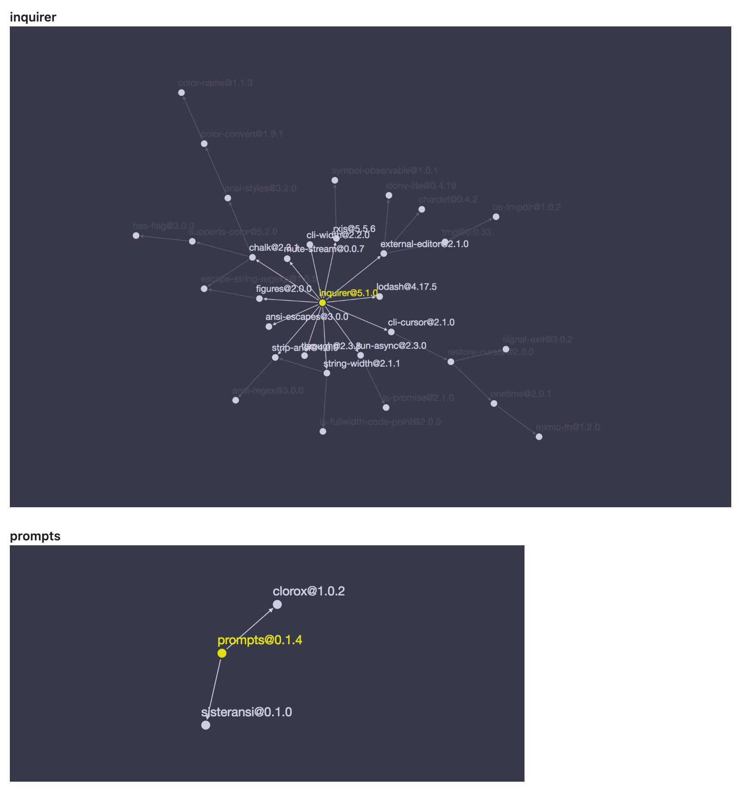

# prompts

https://github.com/terkelg/prompts

creaite-vite 使用的是它

在意 size 的人，推荐 prompts；在意 maintainable，推荐 inquirer



下面讲一下 prompts 的测试方法。

## .inject

用于测试的就这一个方法

```js
let injected = [1, 2];
prompt.inject(injected);
```

Note: injected 参数是所有 prompts 需要的，所以它是数组

这里的 1 是第一轮的时候注入的参数，2 是第二轮的时候注入的参数。

依次类推，大概率你需要的是一个对象数据。

这就是官方里所说的 Testable，是不是非常简单！

## 完整测试代码

```js
import { expect, test } from "vitest";
import prompt from "prompts";

test("should work as expected", async () => {
  let injected = [1, 2];
  prompt.inject(injected);

  // first round
  const foo = await prompt({ type: "text", name: "a", message: "a message" });
  expect(foo.a).toBe(1);

  // second round
  const bar = await prompt({ type: "text", name: "b", message: "a message" });
  expect(bar.b).toBe(2);
});
```
